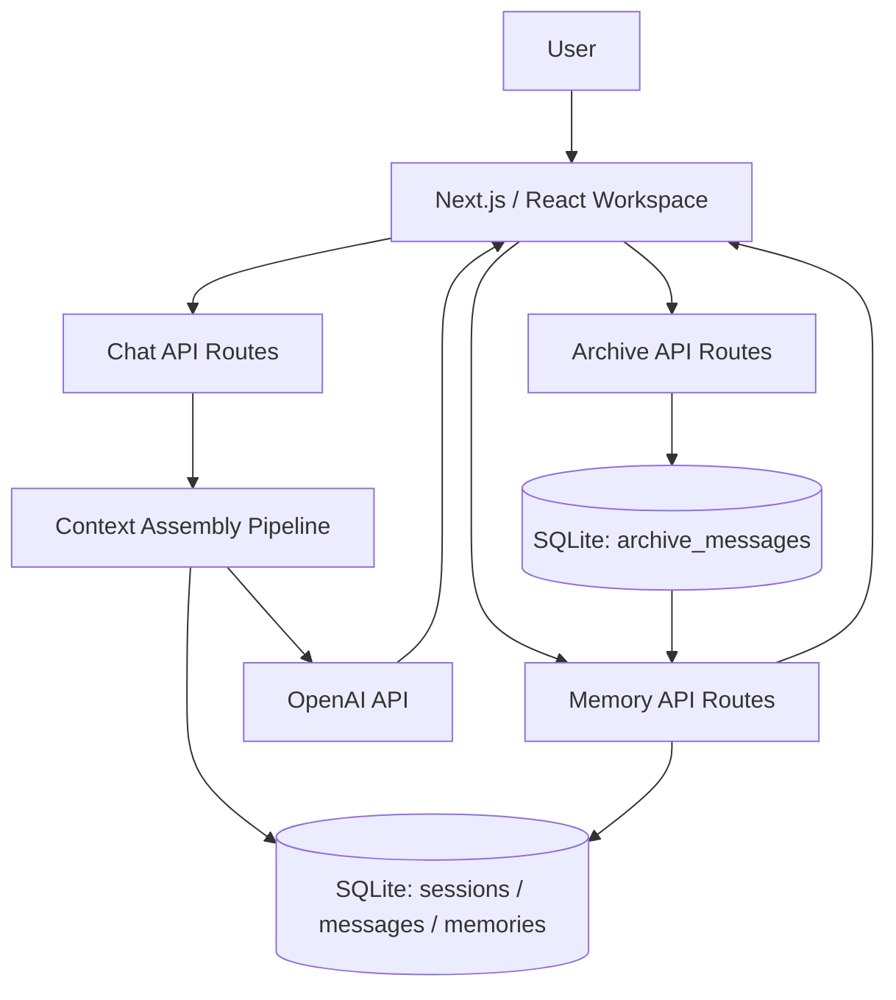

# DartBoard

Stateful AI workspace for explicit context control across chat, memory, and historical archive data.

[Live App](https://dartboard-production-71e8.up.railway.app)  
[Public Repo](https://github.com/DanielLezh13/DartBoard-public)

## 10-Second Summary

DartBoard is an AI workspace built for longer-running workflows where context quality actually matters.

It separates:
- Archive (historical data)
- Memory (structured reusable context)
- Live chat (active inference)

Users can search prior conversations, convert useful messages into editable memories, and decide exactly what context gets attached or pinned per session before the model responds.

## Overview

DartBoard treats memory as a user-controlled product surface instead of hidden prompt text.

Imported chat history, saved ideas, and live conversations all feed into one workflow:

`archive -> memory -> active chat`

The goal is long-running, context-aware AI work without losing control over what the model sees.

## Architecture



## How It Works

1. Users import or search old conversations in Archive.
2. Useful messages can be promoted into editable Memory entries.
3. During chat, users attach or pin the memories they want the model to see.
4. DartBoard assembles context from system rules, mode state, focus state, attached memory, and recent session history.
5. The assembled prompt is sent to the model and returned in the live workspace.

## Key Capabilities

- **Archive -> memory workflow:** search prior conversations, then promote useful results into reusable memory.
- **Explicit context control:** attach, detach, reorder, and pin memories at the session level.
- **Long-context handling:** rolling summaries and budgeted history selection before model calls.
- **Real product systems:** auth, billing, plan limits, usage gates, and archive import/search are built into the runtime.

## Engineering Highlights

- `Next.js 14` + `React 18` + `TypeScript` app-router architecture with server routes separated from client workspace state.
- `better-sqlite3` (WAL) data model covering sessions, messages, memories, attachments, archive data, usage, and billing state.
- Deterministic prompt assembly with layered context injection and pinned-memory controls.
- Archive ingestion/search for ChatGPT exports (`.json` / `.parquet`) with normalization, filtering, and context-window retrieval.
- Multi-panel workspace UX with drag-and-drop memory/session flows and optimistic client-server sync.

## Core Workflows

- Create chats and organize them with folder rails.
- Create/edit memories in the right panel.
- Drag memories into chat to inject context.
- Pin/unpin attached memories to control what stays in scope.
- Import ChatGPT exports (`.json` / `.parquet`) into Archive.
- Search archive with filters, timeline navigation, and source segmentation.
- Save archive content into memory via archive vault flow.

## 2-Minute Product Tour (For Reviewers)

1. Open Chat and start a new session.
2. Create one memory in the right panel.
3. Drag that memory into chat and send a prompt.
4. Open Archive and run a search.
5. Save one useful archive result into memory.
6. Return to chat and attach that memory as context.

## Product Media

[▶ Demo Video](https://github.com/user-attachments/assets/891ebf04-f75f-4798-94dc-e0a459b4d825)


## Stack

- Next.js App Router + React + TypeScript
- Tailwind + Radix + dnd-kit
- SQLite (`better-sqlite3`) on persistent disk
- Supabase Auth
- OpenAI API
- Stripe billing + webhooks

## UI Region Map

- `SessionFolderRail`: left folder bubbles for chat sessions.
- `SessionListPane`: left session list for the selected folder.
- `MemoryDock`: right-side container for memory navigation/editing.
- `MemoryFolderRail`: right folder bubbles for memories.
- `MemoryPanel`: right memory list/search panel.
- `MemoryDetailOverlay`: in-chat memory editor/reader overlay.

## Deployment Notes

- Single-node deployment model with persistent mounted volume.
- Production DB path example: `DB_PATH=/data/dartz_memory.db`.
- Main route groups are documented in [docs/API_ROUTE_MAP.md](docs/API_ROUTE_MAP.md).

## Local Setup

```bash
npm install
cp .env.example .env.local
npm run dev
```

Open `http://localhost:3000`.

## Environment Variables

Required:
- `OPENAI_API_KEY`
- `NEXT_PUBLIC_SUPABASE_URL`
- `NEXT_PUBLIC_SUPABASE_ANON_KEY`
- `SUPABASE_SERVICE_ROLE_KEY`
- `DB_PATH`
- `APP_URL`
- `NEXT_PUBLIC_APP_URL`
- `NEXT_PUBLIC_BASE_URL`
- `STRIPE_SECRET_KEY`
- `NEXT_PUBLIC_STRIPE_PUBLISHABLE_KEY`
- `STRIPE_PLUS_PRICE_ID`
- `STRIPE_WEBHOOK_SECRET`

Optional:
- `TAVILY_API_KEY`
- `GEMINI_API_KEY`
- `DARTZ_MAX_OUTPUT_TOKENS`

## Stripe Webhook

Endpoint:
- `https://<your-domain>/api/billing/webhook`

Subscribe:
- `checkout.session.completed`
- `customer.subscription.created`
- `customer.subscription.updated`
- `customer.subscription.deleted`

## Scripts

- `npm run dev`
- `npm run typecheck`
- `npm run lint`
- `npm run build`
- `npm run start`

## Quality Gates

- GitHub Actions CI runs lint + typecheck on pushes/PRs to `main`.

## Latest Verified Gate + Smoke (February 28, 2026)

- `npm run typecheck`: pass
- `npm run lint`: pass (0 warnings, 0 errors)
- `npm run build`: pass
- Live smoke: pass
  - New chat + memory attach
  - Delete chat/session behavior
  - Folder create/delete on both rails
  - Profile save/load

Known build warnings (non-fatal):
- Unresolved optional `@dsnp/parquetjs` path in archive import route
- Dynamic server usage warnings for API routes using `cookies` / `request.url`

## Docs

- [Repo Map](docs/REPO_MAP.md)
- [API Route Map](docs/API_ROUTE_MAP.md)
- [Launch Checklist](docs/LAUNCH_CHECKLIST.md)
- [Manual QA Script](docs/MANUAL_QA_SCRIPT.md)
