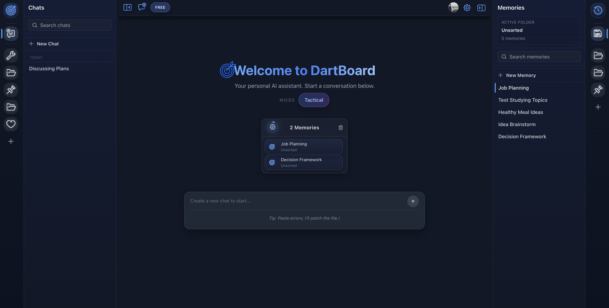
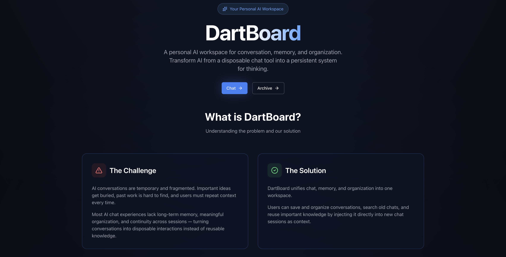
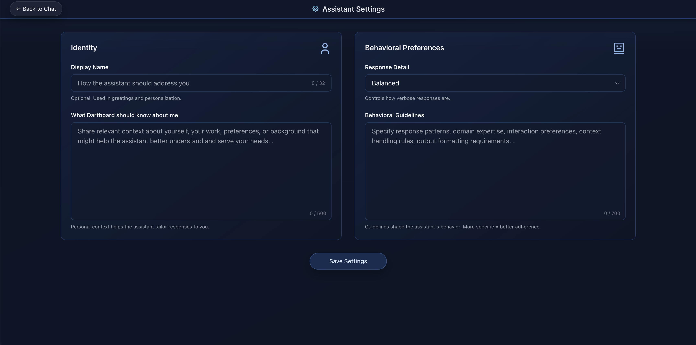
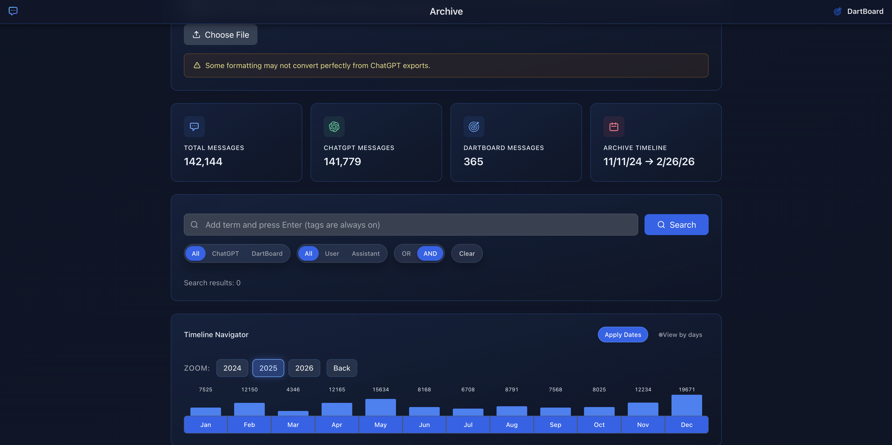
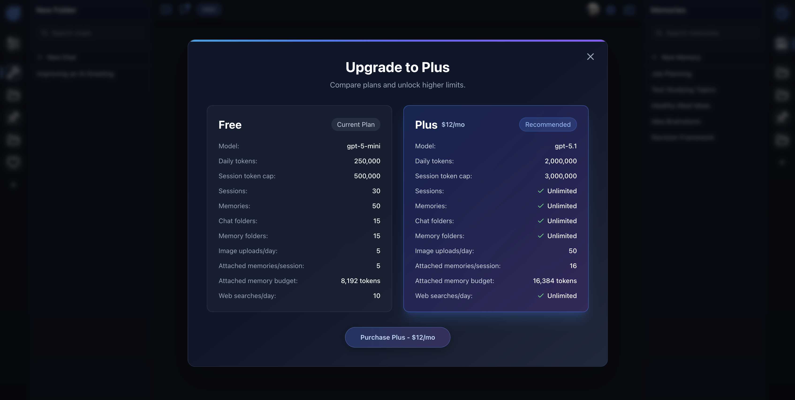

# DartBoard

Stateful AI workspace for chat, memory, and archive-driven context.

Live app: `https://dartboard-production-71e8.up.railway.app`

## 10-Second Summary

DartBoard is a stateful AI workspace that gives users explicit control over model context.

It separates:
- Archive (historical data)
- Memory (structured reusable context)
- Live chat (active inference)

and lets users compose them deliberately per session.

## Overview

DartBoard is an AI workspace designed around explicit, user-controlled context.

Instead of treating memory as hidden prompt text, DartBoard exposes memory as a first-class object that can be created, edited, attached, and reused across sessions. Imported chat history, saved ideas, and live conversations all feed into a single workflow:

`archive -> memory -> active chat`

The goal is long-running, context-aware AI work without losing control over what the model sees.

## Key Capabilities

- **Persistent memory system:** create reusable memory entries from chats or imported history and attach them directly to new sessions.
- **Archive-driven context:** import ChatGPT exports, search timelines, and promote past messages into structured memory.
- **Session-level context control:** attach, detach, reorder, and pin memories to define exactly what stays in scope.
- **Real product constraints:** plan limits, Stripe billing flows, and session governance built into runtime behavior.

## Core Workflows

- Create chats and organize them with folder rails.
- Create/edit memories in the right panel.
- Drag memories into chat to inject context.
- Pin/unpin attached memories to control what stays in scope.
- Import ChatGPT exports (`.json` / `.parquet`) into Archive.
- Search archive with filters, timeline navigation, and source segmentation.
- Save archive content into memory via archive vault flow.

## 2-Minute Product Tour (For Reviewers)

1. Open Chat and start a new session.
2. Create one memory in the right panel.
3. Drag that memory into chat and send a prompt.
4. Open Archive and run a search.
5. Save one useful archive result into memory.
6. Return to chat and attach that memory as context.

## Product Media

[▶ Demo Video](https://github.com/user-attachments/assets/891ebf04-f75f-4798-94dc-e0a459b4d825)







## Stack

- Next.js App Router + React + TypeScript
- Tailwind + Radix + dnd-kit
- SQLite (`better-sqlite3`) on persistent disk
- Supabase Auth
- OpenAI API
- Stripe billing + webhooks

## Architecture Notes

- Single-node deployment model with persistent mounted volume.
- Production DB path example: `DB_PATH=/data/dartz_memory.db`.
- Main route groups are documented in [docs/API_ROUTE_MAP.md](docs/API_ROUTE_MAP.md).

## UI Region Map

- `SessionFolderRail`: left folder bubbles for chat sessions.
- `SessionListPane`: left session list for the selected folder.
- `MemoryDock`: right-side container for memory navigation/editing.
- `MemoryFolderRail`: right folder bubbles for memories.
- `MemoryPanel`: right memory list/search panel.
- `MemoryDetailOverlay`: in-chat memory editor/reader overlay.

## Local Setup

```bash
npm install
cp .env.example .env.local
npm run dev
```

Open `http://localhost:3000`.

## Environment Variables

Required:
- `OPENAI_API_KEY`
- `NEXT_PUBLIC_SUPABASE_URL`
- `NEXT_PUBLIC_SUPABASE_ANON_KEY`
- `SUPABASE_SERVICE_ROLE_KEY`
- `DB_PATH`
- `APP_URL`
- `NEXT_PUBLIC_APP_URL`
- `NEXT_PUBLIC_BASE_URL`
- `STRIPE_SECRET_KEY`
- `NEXT_PUBLIC_STRIPE_PUBLISHABLE_KEY`
- `STRIPE_PLUS_PRICE_ID`
- `STRIPE_WEBHOOK_SECRET`

Optional:
- `TAVILY_API_KEY`
- `GEMINI_API_KEY`
- `DARTZ_MAX_OUTPUT_TOKENS`

## Stripe Webhook

Endpoint:
- `https://<your-domain>/api/billing/webhook`

Subscribe:
- `checkout.session.completed`
- `customer.subscription.created`
- `customer.subscription.updated`
- `customer.subscription.deleted`

## Scripts

- `npm run dev`
- `npm run typecheck`
- `npm run lint`
- `npm run build`
- `npm run start`

## Quality Gates

- GitHub Actions CI runs lint + typecheck on pushes/PRs to `main`.

## Latest Verified Gate + Smoke (February 28, 2026)

- `npm run typecheck`: pass
- `npm run lint`: pass (0 warnings, 0 errors)
- `npm run build`: pass
- Live smoke: pass
  - New chat + memory attach
  - Delete chat/session behavior
  - Folder create/delete on both rails
  - Profile save/load

Known build warnings (non-fatal):
- Unresolved optional `@dsnp/parquetjs` path in archive import route
- Dynamic server usage warnings for API routes using `cookies` / `request.url`

## Docs

- [Repo Map](docs/REPO_MAP.md)
- [API Route Map](docs/API_ROUTE_MAP.md)
- [Launch Checklist](docs/LAUNCH_CHECKLIST.md)
- [Manual QA Script](docs/MANUAL_QA_SCRIPT.md)
